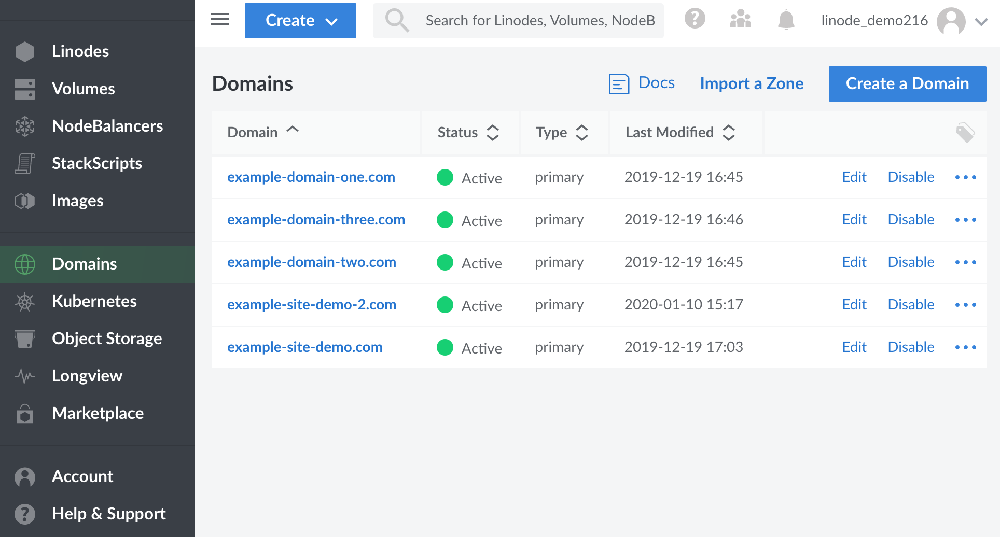
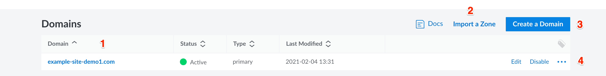

The *Domains* section of the [Cloud Manager](https://cloud.linode.com/domains) is a comprehensive DNS management interface that allows you to add DNS records for all of your domain names. This guide covers the use of the **Domains** section and basic domain setup. For an introduction to DNS in general, see our [Introduction to DNS Records](/docs/guides/dns-records-an-introduction/) guide.


Linode's DNS service is anycasted to over 250 locations around the world. This provides distributed denial-of-service (DDoS) attack mitigation, load balancing, and increased geographic distribution for our [name servers](/docs/guides/dns-records-an-introduction/#name-servers). These factors make our service reliable, fast, and a great choice for your DNS needs.



To use the Linode DNS Manager to serve your domains, you must have an active Linode on your account. If you remove all active Linodes, your domains will no longer be served.


## Getting Started

The Domain Name System (DNS) attaches human-readable domain names to machine-usable IP addresses. In many ways, it is the phone book of the Internet. Just like a phone book can help you find the phone number of a business, DNS can take a domain name like `google.com` and translate it into an IP address like `74.125.19.147`. This global system allows users to remember the names of websites instead of their numeric IP addresses.


All steps in this guide are completed within the **[Domains](https://cloud.linode.com/domains)** section of the [Linode Cloud Manager](https://cloud.linode.com/).


## DNS Set-Up Checklist

DNS records are only actively hosted on accounts with at least one Linode. When setting up a domain name on your Linode, make sure you perform the following steps:

1.  Register (purchase) a domain name if you haven't already.
2.  Set your domain name to [use Linode's name servers](#use-linodes-name-servers-with-your-domain). You'll need to do this on your domain registrar's website and then wait up to 24 hours for the change to take effect.
3.  Use the DNS Manager to [add a domain](#add-a-domain), and then start [adding some basic DNS records](#add-dns-records).
4.  [Set reverse DNS](/docs/guides/configure-your-linode-for-reverse-dns/).
5.  If you have any special DNS requirements, such as when using a third-party email server, add additional DNS records [for your specific needs](/docs/guides/common-dns-configurations/).

## Use Linode's Name Servers with Your Domain

After you purchase a domain, log in to your domain registrar's control panel and set the name servers for your domain name to the entries below. See the instructions on your domain name registrar's website for more information.

-   `ns1.linode.com`
-   `ns2.linode.com`
-   `ns3.linode.com`
-   `ns4.linode.com`
-   `ns5.linode.com`

 
DNS changes can take up to 24 hours to propagate throughout the internet, although the changes are usually visible within several hours.


## Create and Manage Domains

The Linode DNS Manager allows you to create and manage domains. The DNS manager can be accessed from the **Domains** section of the Linode Cloud Manager. To find this area, log in to your [Cloud Manager](https://cloud.linode.com/) account and click the **Domains** link in the sidebar.

### DNS Manager Options Overview

The section below provides a detailed description of the available options within the **Domains** section of the Linode Cloud Manager:

1.  All of your domains are listed under the **Domains** heading. To access your Domain's DNS records, click the name of a Domain.

    Click the name of a domain to add or edit its DNS records. When you add a domain, the Cloud Manager will automatically create a zone file for your Domain.  Before you can add any DNS records, you must [add a domain](#add-a-domain).

    
A *domain zone* is a collection of DNS records for a single domain name. **Creating a domain also creates its corresponding domain zone.** [Linode's APIv4](https://developers.linode.com/api/v4/), which is the backbone of the Cloud Manager, will validate the created zone file for any errors.

The term *domain zone* becomes synonymous with the term *domain*, both in terms of use and administration.


1.  If you have a zone that can be exported from a server or another hosting provider, click **Import a Zone** to import it.

1.  Click **Create a Domain** to create a new domain zone.

1. Click on the **Edit** button next to a domain zone to edit DNS records within a zone.

1.  Click on the **more options ellipsis** to corresponding to clone an existing zone, or remove a zone.